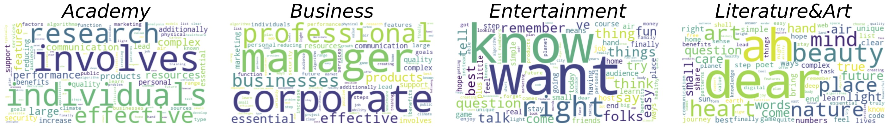
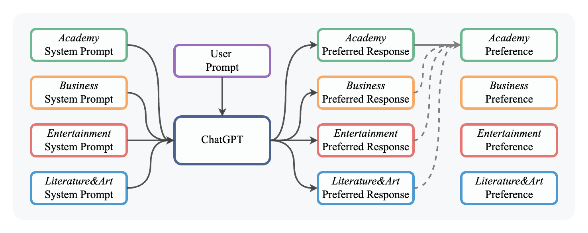
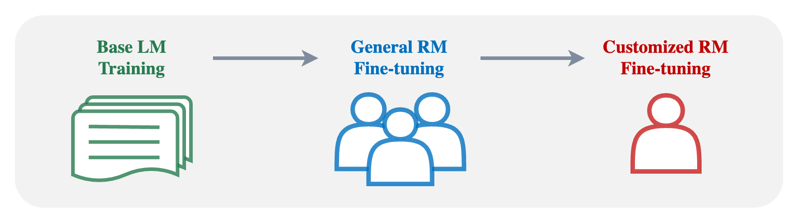

# Learning Customized Human Preferences
<p align="center">
  
</p>

This is the repo for paper 
[Everyone Deserves A Reward: Learning Customized Human Preferences](https://arxiv.org/abs/2309.03126), 
which contains:
- the [Domain-Specific Preference](data/) (DSP) dataset,
- the cleaned general preference datasets including [Helpful&Harmless](https://github.com/anthropics/hh-rlhf/tree/master), [WebGPT](https://huggingface.co/datasets/openai/webgpt_comparisons), and
[GPT-4-LLM](https://github.com/Instruction-Tuning-with-GPT-4/GPT-4-LLM/tree/main/data),
- the implementation of customized reward model learning.

## Overview

Reward models (RMs) are essential for aligning LLMs with human preferences. However, the real world is pluralistic. Besides universal values,  human preferences can be diversified based on different religions, politics, cultures, etc. This leads to an
interesting question: *"How to learn a customized reward model well while preserving its general preference ability?"* To answer this, we collect a Domain-Specific Preference (DSP) dataset and test multiple training and data strategies for customized RM
learning.


## Domain-Specific Preference (DSP) Dataset


We collect domain-specific preferences from the four typical domains: *Academy*, *Business*, *Entertainment*, and *Literature\&Art*. We select 13K instructions from the 52K [Alpaca](https://github.com/tatsu-lab/stanford_alpaca) training set, then ask ChatGPT
with domain-specific system prompts to collect preferred responses from each domain, as shown in the figure below.

<p align="center">
  
</p>

The collected data are  `data/domain_specific_preference.train.json` and `data/domain_specific_preference.test.json`, which are lists of items including the following keys:
- `query`: a question collected from the [Alpaca](https://github.com/tatsu-lab/stanford_alpaca) training set,
- `responses`: a collection of responses from the four application domains (`academy`, `business`, `entertainment`, `literature`) additionally with the origin response from Alpaca (marked as `normal`).

To convert the collected responses into a preference data format, use the following command:
```bash
DOMAIN="academy"
DATA_TYPE="train"

python3 reward_datasets.py \
       --input_data_path data/domain_specific_preference.${DATA_TYPE}.json \
       --domain ${DOMAIN} \
       --output_data_path data/dsp_${DOMAIN}_pairs.${DATA_TYPE}.json \
       --convert --to_pairs
```
where `DOMAIN` can be changed to the other four domains, and `DATA_TYPE` is set from `train` and `test`.
After the conversion, the preference data has a `text`-`score` format, where each item contains two keys:
- `text`: a list of text, each of which combines the query and one response as a complete human-assistant interaction,
- `score`: a list of scores, each of which is a preference score to the corresponding interaction.

Besides, we also cleaned the general preference comparisons from [Helpful&Harmless](https://github.com/anthropics/hh-rlhf/tree/master), [WebGPT](https://huggingface.co/datasets/openai/webgpt_comparisons), and
[GPT-4-LLM](https://github.com/Instruction-Tuning-with-GPT-4/GPT-4-LLM/tree/main/data) datasets and convert them into the same `text`-`score` format.

## Customized RM training
<p align="center">
  
</p>

To learn customized human preferences, we design a three-stage RM training scheme as shown in the figure above. For base LM training, we directly use the pretrained LLMs including [LLaMA-7B](https://huggingface.co/decapoda-research/llama-7b-hf) and [Alpaca-7B](https://huggingface.co/chavinlo/alpaca-native). To reproduce our results on general RM fine-tuning (GRFT) and customized RM fine-tuning (CRFT), first install the dependencies with `Python3.8`:
```bash
pip3 install -r requirements.txt
```
Note that we conduct all our experiments with 8 A100PRO 40G GPUs.

For general RM fine-tuning, use the following command:
```bash
DATA_DIR="data"
TRAIN_DATA_LIST="${DATA_DIR}/helpful.train.json \
                 ${DATA_DIR}/harmless.train.json"
TEST_DATA_LIST="${DATA_DIR}/helpful.test.json \
                 ${DATA_DIR}/harmless.test.json \
                 ${DATA_DIR}/webgpt.test.json \
                 ${DATA_DIR}/gpt4llm.test.json"
LM_COEFF=0.

torchrun --nproc_per_node=8 --master_port=6000 train.py \
    --do_train True --eval_at_start True\
    --lm_loss_coeff ${LM_COEFF} \
    --model_name_or_path <your_path_to_hf_converted_llama_ckpt_and_tokenizer> \
    --train_data_path ${TRAIN_DATA_LIST} \
    --eval_data_path ${TEST_DATA_LIST} \
    --remove_unused_columns false \
    --reward_domain general \
    --output_dir <your_path_to_save_experiment_results> \
    --num_train_epochs 1 \
    --per_device_train_batch_size 1 \
    --per_device_eval_batch_size 1 \
    --gradient_accumulation_steps 8 \
    --evaluation_strategy steps \
    --padding_side right \
    --truncation_side left \
    --pooling_type last \
    --max_length 512 \
    --save_strategy steps \
    --learning_rate 1e-6 \
    --warmup_steps 100 \
    --logging_steps 1 \
    --eval_steps 100 \
    --save_steps 300 \
    --deepspeed configs/default_offload_opt_param.json \
    --tf32 false --fp16 false
```
Here we can change the `TRAIN_DATA_LIST` to select which general preference data to use for GRFT. If `LM_COEFF` is set positive, RM will be trained additionally with the language modeling loss on preferred samples.

For customized RM fine-tuning, use the following command:
```bash
DOMAIN="academy"
DATA_DIR="data"
TRAIN_DATA_LIST="${DATA_DIR}/dsp_${DOMAIN}_pairs.train.json"
TEST_DATA_LIST="${DATA_DIR}/helpful.test.json \
                 ${DATA_DIR}/harmless.test.json \
                 ${DATA_DIR}/webgpt.test.json \
                 ${DATA_DIR}/gpt4llm.test.json \
                 ${DATA_DIR}/dsp_${DOMAIN}_pairs.test.json"
LM_COEFF=0.

torchrun --nproc_per_node=8 --master_port=6000 train.py \
    --do_train True --eval_at_start True\
    --lm_loss_coeff ${LM_COEFF} \
    --model_name_or_path <your_path_to_general_rm_ckpt_and_tokenizer> \
    --train_data_path ${TRAIN_DATA_LIST} \
    --eval_data_path ${TEST_DATA_LIST} \
    --remove_unused_columns false \
    --reward_domain ${DOMAIN} \
    --output_dir <your_path_to_save_experiment_results> \
    --num_train_epochs 1 \
    --per_device_train_batch_size 1 \
    --per_device_eval_batch_size 1 \
    --gradient_accumulation_steps 32 \
    --evaluation_strategy steps \
    --padding_side right \
    --truncation_side left \
    --pooling_type last \
    --max_length 512 \
    --save_strategy steps \
    --learning_rate 1e-7 \
    --warmup_steps 0 \
    --logging_steps 1 \
    --eval_steps 1 \
    --save_steps 100 \
    --deepspeed configs/default_offload_opt_param.json \
    --tf32 false --fp16 false
```
Here `DOMAIN` can be selected from `["academy", "business", "entertainment", "literature"]` for fine-tuning RM on preferences of different domains. 

# Citation
```
@article{cheng2023deserves,
      title={Everyone Deserves A Reward: Learning Customized Human Preferences}, 
      author={Pengyu Cheng and Jiawen Xie and Ke Bai and Yong Dai and Nan Du},
      journal={arXiv preprint arXiv:2309.03126},
      year={2023}
}
```
